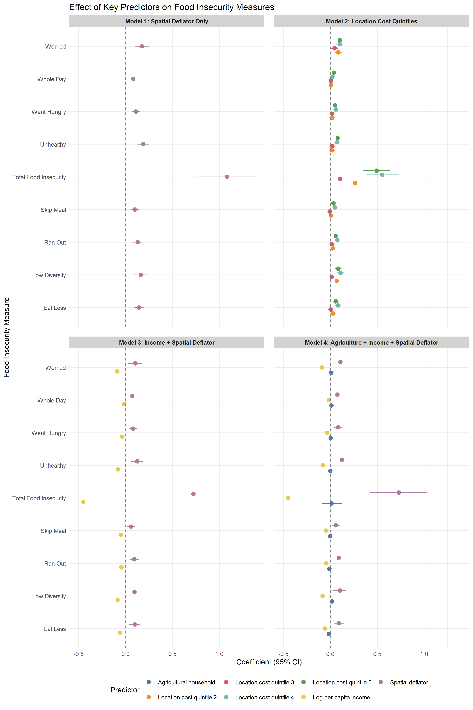
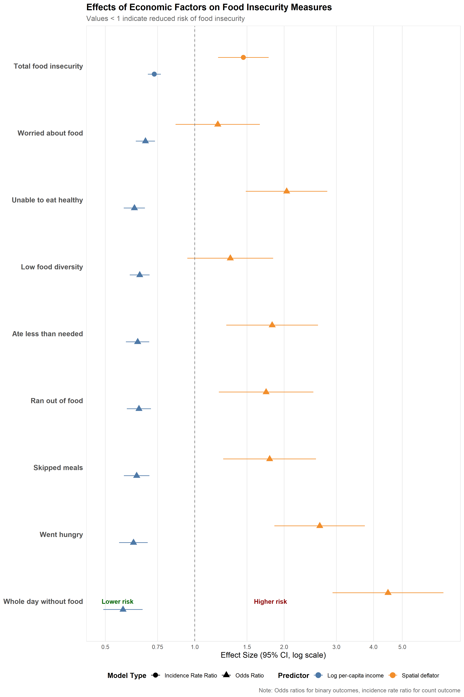

# Untitled

<link href="Food_insecuity_files/libs/lightable-0.0.1/lightable.css" rel="stylesheet" />

# Summary of Food Inscurity

### Fies Indicators over time

This chart displays the levels of food insecurity in Indonesia from
March 2024 to January 2025, highlighting a general downward trend across
all FIES (Food Insecurity Experience Scale) indicators, with milder
concerns like “worried about not having enough food” (29.8%) remaining
most prevalent, while severe experiences such as “went without eating
for a whole day” (2.3%) affected the smallest portion of the population.

<noscript>

</noscript>

### Distribution of number of FIES deprivations

Indonesia’s FIES deprivation data reveals 63.4% of the population
experiences zero food insecurity indicators, with percentages steadily
declining as severity increases—12.9% face one deprivation, 5.7% face
two, and only 1.8% of Indonesians experience all eight FIES
deprivations, demonstrating that food insecurity follows a clear
gradient with most citizens experiencing either none or few food
challenges.

## Step chart

<noscript>

</noscript>

## Area chart by count

<noscript>

</noscript>

### Regional comparison for latest month

Regional food insecurity patterns across Indonesia’s major islands
display distinct variations, with Nusa Tenggara and Maluku showing
larger footprints suggesting more severe challenges, while Kalimantan
and Papua exhibit more compact profiles indicating potentially fewer or
less intense food security issues across measured dimensions.

<noscript>

</noscript>

# Relationship between Inflation and Food Insecurity

Analysis of Indonesian household data reveals a significant correlation
between rising food prices (Inflation) and increased FIES indicators,
both within and between regions

<noscript>

</noscript>

#### Model Summary

#### tables

## Linear model

<table class="table table table-striped table-hover table-condensed"
data-quarto-postprocess="true"
style="NAborder-bottom: 0; width: auto !important; margin-left: auto; margin-right: auto; width: auto !important; margin-left: auto; margin-right: auto;">
<caption>Household Fixed Effects Linear Models</caption>
<colgroup>
<col style="width: 10%" />
<col style="width: 10%" />
<col style="width: 10%" />
<col style="width: 10%" />
<col style="width: 10%" />
<col style="width: 10%" />
<col style="width: 10%" />
<col style="width: 10%" />
<col style="width: 10%" />
<col style="width: 10%" />
</colgroup>
<thead>
<tr class="header">
<th data-quarto-table-cell-role="th"
style="text-align: left; empty-cells: hide; border-bottom: hidden;"></th>
<th colspan="9" data-quarto-table-cell-role="th"
style="text-align: center; border-bottom: hidden; padding-bottom: 0; padding-left: 3px; padding-right: 3px;">

Food Insecurity Outcomes

</th>
</tr>
<tr class="odd">
<th style="text-align: left;" data-quarto-table-cell-role="th"></th>
<th style="text-align: center;"
data-quarto-table-cell-role="th">Worried</th>
<th style="text-align: center;"
data-quarto-table-cell-role="th">Unhealthy</th>
<th style="text-align: center;" data-quarto-table-cell-role="th">Low
Diversity</th>
<th style="text-align: center;" data-quarto-table-cell-role="th">Skip
Meal</th>
<th style="text-align: center;" data-quarto-table-cell-role="th">Eat
Less</th>
<th style="text-align: center;" data-quarto-table-cell-role="th">Ran
Out</th>
<th style="text-align: center;" data-quarto-table-cell-role="th">Went
Hungry</th>
<th style="text-align: center;" data-quarto-table-cell-role="th">Whole
Day</th>
<th style="text-align: center;"
data-quarto-table-cell-role="th">Totfoodinsec</th>
</tr>
</thead>
<tbody>
<tr class="odd">
<td style="text-align: left; box-shadow: 0px 1.5px;">Consumer Price
Index</td>
<td style="text-align: center; box-shadow: 0px 1.5px;">0.049***
(0.006)</td>
<td style="text-align: center; box-shadow: 0px 1.5px;">0.042***
(0.006)</td>
<td style="text-align: center; box-shadow: 0px 1.5px;">0.050***
(0.007)</td>
<td style="text-align: center; box-shadow: 0px 1.5px;">0.013***
(0.005)</td>
<td style="text-align: center; box-shadow: 0px 1.5px;">0.037***
(0.006)</td>
<td style="text-align: center; box-shadow: 0px 1.5px;">0.039***
(0.005)</td>
<td style="text-align: center; box-shadow: 0px 1.5px;">0.019***
(0.004)</td>
<td style="text-align: center; box-shadow: 0px 1.5px;">0.006**
(0.003)</td>
<td style="text-align: center; box-shadow: 0px 1.5px;">0.255***
(0.026)</td>
</tr>
<tr class="even">
<td style="text-align: left;">Num.Obs.</td>
<td style="text-align: center;">15484</td>
<td style="text-align: center;">15481</td>
<td style="text-align: center;">15480</td>
<td style="text-align: center;">15477</td>
<td style="text-align: center;">15477</td>
<td style="text-align: center;">15475</td>
<td style="text-align: center;">15474</td>
<td style="text-align: center;">15474</td>
<td style="text-align: center;">15561</td>
</tr>
</tbody><tfoot>
<tr class="even">
<td style="text-align: left; padding: 0;"> * p &lt; 0.1, ** p
&lt; 0.05, *** p &lt; 0.01</td>
<td style="text-align: center;"></td>
<td style="text-align: center;"></td>
<td style="text-align: center;"></td>
<td style="text-align: center;"></td>
<td style="text-align: center;"></td>
<td style="text-align: center;"></td>
<td style="text-align: center;"></td>
<td style="text-align: center;"></td>
<td style="text-align: center;"></td>
</tr>
<tr class="odd">
<td style="text-align: left; padding: 0;"> Standard errors
clustered at household level</td>
<td style="text-align: center;"></td>
<td style="text-align: center;"></td>
<td style="text-align: center;"></td>
<td style="text-align: center;"></td>
<td style="text-align: center;"></td>
<td style="text-align: center;"></td>
<td style="text-align: center;"></td>
<td style="text-align: center;"></td>
<td style="text-align: center;"></td>
</tr>
</tfoot>
&#10;</table>

Household Fixed Effects Linear Models

## Logit model

| Food Insecurity Measure                                                                                                                    | Odds Ratio (95% CI)    | Std. Error |
|:-------------------------------------------------------------------------------------------------------------------------------------------|:-----------------------|:-----------|
| Worried about food                                                                                                                         | 1.48\*\*\* (1.33-1.64) | 0.054      |
| Unable to eat healthy                                                                                                                      | 1.43\*\*\* (1.28-1.60) | 0.056      |
| Low food diversity                                                                                                                         | 1.49\*\*\* (1.34-1.66) | 0.054      |
| Skipped meals                                                                                                                              | 1.20\*\* (1.04-1.38)   | 0.071      |
| Ate less than needed                                                                                                                       | 1.49\*\*\* (1.32-1.69) | 0.063      |
| Ran out of food                                                                                                                            | 1.66\*\*\* (1.45-1.90) | 0.070      |
| Went hungry                                                                                                                                | 1.40\*\*\* (1.20-1.64) | 0.080      |
| Whole day without food                                                                                                                     | 1.23\* (0.98-1.55)     | 0.117      |
| Total food insecurity                                                                                                                      | 1.39\*\*\* (1.21-1.61) | 0.072      |
| \* \* p \< 0.1, \*\* p \< 0.05, \*\*\* p \< 0.01                                                                                |                        |            |
| † Odds ratios represent the effect of a one-unit increase in CPI on the likelihood of experiencing each food insecurity outcome |                        |            |
| ‡ Standard errors are robust and clustered at household level                                                                   |                        |            |
| § Models estimated using conditional logistic regression (clogit)                                                               |                        |            |

Effect of Consumer Price Index (CPI) on Food Insecurity: Household Fixed
Effects Logistic Models

# Relationship between Inflation and Income

These regression models show the relationship between income and the
different FIES components, revealing how economic factors such as
household income, local food costs, and agricultural participation
influence various dimensions of food insecurity. The analysis examines
eight distinct food insecurity indicators—from worrying about food to
going whole days without eating—and explores how these experiences vary
across income quintiles and local food cost distributions. By regressing
each food insecurity measure against per capita income, local food
prices, and agricultural household status, we can identify which
economic factors most strongly predict different manifestations of food
insecurity in Indonesia.

#### Model Summary

$$
\begin{align}
\text{Model 1: } & y_i = \beta_0 + \beta_1 \text{pdef3}_i + \varepsilon_i \\
\text{Model 2: } & y_i = \beta_0 + \sum_{j=1}^{4} \beta_j \mathbb{1}(\text{loc\_cost\_quint}_i = j+1) + \varepsilon_i \\
\text{Model 3: } & y_i = \beta_0 + \beta_1 \text{ln\_pc\_def\_inc}_i + \beta_2 \text{pdef3}_i + \varepsilon_i \\
\text{Model 4: } & y_i = \beta_0 + \beta_1 \text{hhag}_i + \beta_2 \text{ln\_pc\_def\_inc}_i + \beta_3 \text{pdef3}_i + \varepsilon_i\\
\text{Model 5a: } & \log\left(\frac{P(y_i=1)}{1-P(y_i=1)}\right) = \beta_0 + \beta_1 \text{ln\_pc\_def\_inc}_i + \beta_2 \text{pdef3}_i \\
\text{Model 5b: } & \log(E(y_i)) = \beta_0 + \beta_1 \text{ln\_pc\_def\_inc}_i + \beta_2 \text{pdef3}_i
\end{align}
$$

$$\text{where } y_i \text{ represents household-level FIES (Food Insecurity Experience Scale) outcomes}$$
$$\text{Model 5a is used for binary outcomes and Model 5b for count data (when totfoodinsec > 1)}$$

#### Coefficient Definitions:

$$
\begin{align}
\text{Model 1: } & \beta_0 = \text{Constant} \\
& \beta_1 = \text{Spatial deflator} \\
\\
\text{Model 2: } & \beta_0 = \text{Constant} \\
& \beta_1 = \text{Location cost quintile 2} \\
& \beta_2 = \text{Location cost quintile 3} \\
& \beta_3 = \text{Location cost quintile 4} \\
& \beta_4 = \text{Location cost quintile 5} \\
\\
\text{Model 3: } & \beta_0 = \text{Constant} \\
& \beta_1 = \text{Log per-capita income} \\
& \beta_2 = \text{Spatial deflator} \\
\\
\text{Model 4: } & \beta_0 = \text{Constant} \\
& \beta_1 = \text{Agricultural household} \\
& \beta_2 = \text{Log per-capita income} \\
& \beta_3 = \text{Spatial deflator} \\
\\
\text{Model 5a/5b: } & \beta_0 = \text{Constant} \\
& \beta_1 = \text{Log per-capita income} \\
& \beta_2 = \text{Spatial deflator}
\end{align}
$$
$$\text{Note: All models are weighted using population weights (popw) to ensure representativeness.}$$
$$\text{All models use heteroskedasticity-consistent standard errors}$$

#### tables

## model 1

<table class="table table table-striped table-hover table-condensed"
data-quarto-postprocess="true"
style="NAborder-bottom: 0; width: auto !important; margin-left: auto; margin-right: auto; width: auto !important; margin-left: auto; margin-right: auto;">
<caption>Comparison of m1 across different food insecurity
outcomes</caption>
<colgroup>
<col style="width: 10%" />
<col style="width: 10%" />
<col style="width: 10%" />
<col style="width: 10%" />
<col style="width: 10%" />
<col style="width: 10%" />
<col style="width: 10%" />
<col style="width: 10%" />
<col style="width: 10%" />
<col style="width: 10%" />
</colgroup>
<thead>
<tr class="header">
<th data-quarto-table-cell-role="th"
style="text-align: left; empty-cells: hide; border-bottom: hidden;"></th>
<th colspan="9" data-quarto-table-cell-role="th"
style="text-align: center; border-bottom: hidden; padding-bottom: 0; padding-left: 3px; padding-right: 3px;">

Food Insecurity Outcomes

</th>
</tr>
<tr class="odd">
<th style="text-align: left;" data-quarto-table-cell-role="th"></th>
<th style="text-align: center;"
data-quarto-table-cell-role="th">Worried</th>
<th style="text-align: center;"
data-quarto-table-cell-role="th">Unhealthy</th>
<th style="text-align: center;" data-quarto-table-cell-role="th">Low
Diversity</th>
<th style="text-align: center;" data-quarto-table-cell-role="th">Skip
Meal</th>
<th style="text-align: center;" data-quarto-table-cell-role="th">Eat
Less</th>
<th style="text-align: center;" data-quarto-table-cell-role="th">Ran
Out</th>
<th style="text-align: center;" data-quarto-table-cell-role="th">Went
Hungry</th>
<th style="text-align: center;" data-quarto-table-cell-role="th">Whole
Day</th>
<th style="text-align: center;"
data-quarto-table-cell-role="th">Totfoodinsec</th>
</tr>
</thead>
<tbody>
<tr class="odd">
<td style="text-align: left;">Constant</td>
<td style="text-align: center;">0.164*** (0.036)</td>
<td style="text-align: center;">0.026 (0.030)</td>
<td style="text-align: center;">0.130*** (0.034)</td>
<td style="text-align: center;">0.001 (0.020)</td>
<td style="text-align: center;">0.022 (0.027)</td>
<td style="text-align: center;">−0.003 (0.023)</td>
<td style="text-align: center;">−0.029 (0.019)</td>
<td style="text-align: center;">−0.053*** (0.012)</td>
<td style="text-align: center;">0.259* (0.146)</td>
</tr>
<tr class="even">
<td style="text-align: left; box-shadow: 0px 1.5px;">Spatial
deflator</td>
<td style="text-align: center; box-shadow: 0px 1.5px;">0.175***
(0.038)</td>
<td style="text-align: center; box-shadow: 0px 1.5px;">0.189***
(0.032)</td>
<td style="text-align: center; box-shadow: 0px 1.5px;">0.162***
(0.035)</td>
<td style="text-align: center; box-shadow: 0px 1.5px;">0.097***
(0.022)</td>
<td style="text-align: center; box-shadow: 0px 1.5px;">0.144***
(0.028)</td>
<td style="text-align: center; box-shadow: 0px 1.5px;">0.131***
(0.024)</td>
<td style="text-align: center; box-shadow: 0px 1.5px;">0.110***
(0.021)</td>
<td style="text-align: center; box-shadow: 0px 1.5px;">0.083***
(0.013)</td>
<td style="text-align: center; box-shadow: 0px 1.5px;">1.082***
(0.155)</td>
</tr>
<tr class="odd">
<td style="text-align: left;">Num.Obs.</td>
<td style="text-align: center;">15484</td>
<td style="text-align: center;">15481</td>
<td style="text-align: center;">15480</td>
<td style="text-align: center;">15477</td>
<td style="text-align: center;">15477</td>
<td style="text-align: center;">15475</td>
<td style="text-align: center;">15474</td>
<td style="text-align: center;">15474</td>
<td style="text-align: center;">15561</td>
</tr>
<tr class="even">
<td style="text-align: left;">R2</td>
<td style="text-align: center;">0.003</td>
<td style="text-align: center;">0.004</td>
<td style="text-align: center;">0.003</td>
<td style="text-align: center;">0.002</td>
<td style="text-align: center;">0.003</td>
<td style="text-align: center;">0.003</td>
<td style="text-align: center;">0.004</td>
<td style="text-align: center;">0.006</td>
<td style="text-align: center;">0.006</td>
</tr>
<tr class="odd">
<td style="text-align: left;">R2 Adj.</td>
<td style="text-align: center;">0.003</td>
<td style="text-align: center;">0.004</td>
<td style="text-align: center;">0.003</td>
<td style="text-align: center;">0.002</td>
<td style="text-align: center;">0.003</td>
<td style="text-align: center;">0.003</td>
<td style="text-align: center;">0.003</td>
<td style="text-align: center;">0.006</td>
<td style="text-align: center;">0.006</td>
</tr>
</tbody><tfoot>
<tr class="odd">
<td style="text-align: left; padding: 0;"> * p &lt; 0.1, ** p
&lt; 0.05, *** p &lt; 0.01</td>
<td style="text-align: center;"></td>
<td style="text-align: center;"></td>
<td style="text-align: center;"></td>
<td style="text-align: center;"></td>
<td style="text-align: center;"></td>
<td style="text-align: center;"></td>
<td style="text-align: center;"></td>
<td style="text-align: center;"></td>
<td style="text-align: center;"></td>
</tr>
</tfoot>
&#10;</table>

Comparison of m1 across different food insecurity outcomes

## model 2

<table class="table table table-striped table-hover table-condensed"
data-quarto-postprocess="true"
style="NAborder-bottom: 0; width: auto !important; margin-left: auto; margin-right: auto; width: auto !important; margin-left: auto; margin-right: auto;">
<caption>Comparison of m2 across different food insecurity
outcomes</caption>
<colgroup>
<col style="width: 10%" />
<col style="width: 10%" />
<col style="width: 10%" />
<col style="width: 10%" />
<col style="width: 10%" />
<col style="width: 10%" />
<col style="width: 10%" />
<col style="width: 10%" />
<col style="width: 10%" />
<col style="width: 10%" />
</colgroup>
<thead>
<tr class="header">
<th data-quarto-table-cell-role="th"
style="text-align: left; empty-cells: hide; border-bottom: hidden;"></th>
<th colspan="9" data-quarto-table-cell-role="th"
style="text-align: center; border-bottom: hidden; padding-bottom: 0; padding-left: 3px; padding-right: 3px;">

Food Insecurity Outcomes

</th>
</tr>
<tr class="odd">
<th style="text-align: left;" data-quarto-table-cell-role="th"></th>
<th style="text-align: center;"
data-quarto-table-cell-role="th">Worried</th>
<th style="text-align: center;"
data-quarto-table-cell-role="th">Unhealthy</th>
<th style="text-align: center;" data-quarto-table-cell-role="th">Low
Diversity</th>
<th style="text-align: center;" data-quarto-table-cell-role="th">Skip
Meal</th>
<th style="text-align: center;" data-quarto-table-cell-role="th">Eat
Less</th>
<th style="text-align: center;" data-quarto-table-cell-role="th">Ran
Out</th>
<th style="text-align: center;" data-quarto-table-cell-role="th">Went
Hungry</th>
<th style="text-align: center;" data-quarto-table-cell-role="th">Whole
Day</th>
<th style="text-align: center;"
data-quarto-table-cell-role="th">Totfoodinsec</th>
</tr>
</thead>
<tbody>
<tr class="odd">
<td style="text-align: left;">Constant</td>
<td style="text-align: center;">0.263*** (0.012)</td>
<td style="text-align: center;">0.166*** (0.010)</td>
<td style="text-align: center;">0.228*** (0.012)</td>
<td style="text-align: center;">0.075*** (0.007)</td>
<td style="text-align: center;">0.124*** (0.009)</td>
<td style="text-align: center;">0.085*** (0.007)</td>
<td style="text-align: center;">0.046*** (0.006)</td>
<td style="text-align: center;">0.011*** (0.003)</td>
<td style="text-align: center;">0.996*** (0.047)</td>
</tr>
<tr class="even">
<td style="text-align: left;">Location cost quintile 2</td>
<td style="text-align: center;">0.085*** (0.018)</td>
<td style="text-align: center;">0.019 (0.015)</td>
<td style="text-align: center;">0.068*** (0.018)</td>
<td style="text-align: center;">0.007 (0.010)</td>
<td style="text-align: center;">0.029** (0.013)</td>
<td style="text-align: center;">0.027** (0.011)</td>
<td style="text-align: center;">0.021** (0.009)</td>
<td style="text-align: center;">0.007 (0.004)</td>
<td style="text-align: center;">0.262*** (0.071)</td>
</tr>
<tr class="odd">
<td style="text-align: left;">Location cost quintile 3</td>
<td style="text-align: center;">0.044** (0.018)</td>
<td style="text-align: center;">0.021 (0.015)</td>
<td style="text-align: center;">0.014 (0.017)</td>
<td style="text-align: center;">−0.008 (0.009)</td>
<td style="text-align: center;">0.003 (0.013)</td>
<td style="text-align: center;">0.014 (0.011)</td>
<td style="text-align: center;">0.018** (0.009)</td>
<td style="text-align: center;">0.006 (0.004)</td>
<td style="text-align: center;">0.104 (0.067)</td>
</tr>
<tr class="even">
<td style="text-align: left;">Location cost quintile 4</td>
<td style="text-align: center;">0.100*** (0.019)</td>
<td style="text-align: center;">0.072*** (0.017)</td>
<td style="text-align: center;">0.109*** (0.018)</td>
<td style="text-align: center;">0.049*** (0.013)</td>
<td style="text-align: center;">0.081*** (0.016)</td>
<td style="text-align: center;">0.074*** (0.014)</td>
<td style="text-align: center;">0.056*** (0.012)</td>
<td style="text-align: center;">0.021*** (0.007)</td>
<td style="text-align: center;">0.553*** (0.089)</td>
</tr>
<tr class="odd">
<td style="text-align: left; box-shadow: 0px 1.5px;">Location cost
quintile 5</td>
<td style="text-align: center; box-shadow: 0px 1.5px;">0.102***
(0.018)</td>
<td style="text-align: center; box-shadow: 0px 1.5px;">0.079***
(0.015)</td>
<td style="text-align: center; box-shadow: 0px 1.5px;">0.085***
(0.017)</td>
<td style="text-align: center; box-shadow: 0px 1.5px;">0.033***
(0.010)</td>
<td style="text-align: center; box-shadow: 0px 1.5px;">0.056***
(0.014)</td>
<td style="text-align: center; box-shadow: 0px 1.5px;">0.058***
(0.011)</td>
<td style="text-align: center; box-shadow: 0px 1.5px;">0.049***
(0.010)</td>
<td style="text-align: center; box-shadow: 0px 1.5px;">0.036***
(0.005)</td>
<td style="text-align: center; box-shadow: 0px 1.5px;">0.493***
(0.073)</td>
</tr>
<tr class="even">
<td style="text-align: left;">Num.Obs.</td>
<td style="text-align: center;">15484</td>
<td style="text-align: center;">15481</td>
<td style="text-align: center;">15480</td>
<td style="text-align: center;">15477</td>
<td style="text-align: center;">15477</td>
<td style="text-align: center;">15475</td>
<td style="text-align: center;">15474</td>
<td style="text-align: center;">15474</td>
<td style="text-align: center;">15561</td>
</tr>
<tr class="odd">
<td style="text-align: left;">R2</td>
<td style="text-align: center;">0.007</td>
<td style="text-align: center;">0.006</td>
<td style="text-align: center;">0.009</td>
<td style="text-align: center;">0.005</td>
<td style="text-align: center;">0.007</td>
<td style="text-align: center;">0.007</td>
<td style="text-align: center;">0.006</td>
<td style="text-align: center;">0.007</td>
<td style="text-align: center;">0.011</td>
</tr>
<tr class="even">
<td style="text-align: left;">R2 Adj.</td>
<td style="text-align: center;">0.007</td>
<td style="text-align: center;">0.006</td>
<td style="text-align: center;">0.008</td>
<td style="text-align: center;">0.005</td>
<td style="text-align: center;">0.007</td>
<td style="text-align: center;">0.007</td>
<td style="text-align: center;">0.006</td>
<td style="text-align: center;">0.007</td>
<td style="text-align: center;">0.011</td>
</tr>
</tbody><tfoot>
<tr class="even">
<td style="text-align: left; padding: 0;"> * p &lt; 0.1, ** p
&lt; 0.05, *** p &lt; 0.01</td>
<td style="text-align: center;"></td>
<td style="text-align: center;"></td>
<td style="text-align: center;"></td>
<td style="text-align: center;"></td>
<td style="text-align: center;"></td>
<td style="text-align: center;"></td>
<td style="text-align: center;"></td>
<td style="text-align: center;"></td>
<td style="text-align: center;"></td>
</tr>
</tfoot>
&#10;</table>

Comparison of m2 across different food insecurity outcomes

## model 3

<table class="table table table-striped table-hover table-condensed"
data-quarto-postprocess="true"
style="NAborder-bottom: 0; width: auto !important; margin-left: auto; margin-right: auto; width: auto !important; margin-left: auto; margin-right: auto;">
<caption>Comparison of m3 across different food insecurity
outcomes</caption>
<colgroup>
<col style="width: 10%" />
<col style="width: 10%" />
<col style="width: 10%" />
<col style="width: 10%" />
<col style="width: 10%" />
<col style="width: 10%" />
<col style="width: 10%" />
<col style="width: 10%" />
<col style="width: 10%" />
<col style="width: 10%" />
</colgroup>
<thead>
<tr class="header">
<th data-quarto-table-cell-role="th"
style="text-align: left; empty-cells: hide; border-bottom: hidden;"></th>
<th colspan="9" data-quarto-table-cell-role="th"
style="text-align: center; border-bottom: hidden; padding-bottom: 0; padding-left: 3px; padding-right: 3px;">

Food Insecurity Outcomes

</th>
</tr>
<tr class="odd">
<th style="text-align: left;" data-quarto-table-cell-role="th"></th>
<th style="text-align: center;"
data-quarto-table-cell-role="th">Worried</th>
<th style="text-align: center;"
data-quarto-table-cell-role="th">Unhealthy</th>
<th style="text-align: center;" data-quarto-table-cell-role="th">Low
Diversity</th>
<th style="text-align: center;" data-quarto-table-cell-role="th">Skip
Meal</th>
<th style="text-align: center;" data-quarto-table-cell-role="th">Eat
Less</th>
<th style="text-align: center;" data-quarto-table-cell-role="th">Ran
Out</th>
<th style="text-align: center;" data-quarto-table-cell-role="th">Went
Hungry</th>
<th style="text-align: center;" data-quarto-table-cell-role="th">Whole
Day</th>
<th style="text-align: center;"
data-quarto-table-cell-role="th">Totfoodinsec</th>
</tr>
</thead>
<tbody>
<tr class="odd">
<td style="text-align: left;">Constant</td>
<td style="text-align: center;">1.414*** (0.098)</td>
<td style="text-align: center;">1.177*** (0.085)</td>
<td style="text-align: center;">1.322*** (0.094)</td>
<td style="text-align: center;">0.668*** (0.061)</td>
<td style="text-align: center;">0.872*** (0.076)</td>
<td style="text-align: center;">0.635*** (0.065)</td>
<td style="text-align: center;">0.476*** (0.051)</td>
<td style="text-align: center;">0.167*** (0.028)</td>
<td style="text-align: center;">6.676*** (0.423)</td>
</tr>
<tr class="even">
<td style="text-align: left;">Spatial deflator</td>
<td style="text-align: center;">0.105*** (0.038)</td>
<td style="text-align: center;">0.125*** (0.032)</td>
<td style="text-align: center;">0.096*** (0.036)</td>
<td style="text-align: center;">0.060*** (0.022)</td>
<td style="text-align: center;">0.096*** (0.029)</td>
<td style="text-align: center;">0.094*** (0.024)</td>
<td style="text-align: center;">0.082*** (0.020)</td>
<td style="text-align: center;">0.071*** (0.013)</td>
<td style="text-align: center;">0.724*** (0.155)</td>
</tr>
<tr class="odd">
<td style="text-align: left; box-shadow: 0px 1.5px;">Log per-capita
income</td>
<td style="text-align: center; box-shadow: 0px 1.5px;">−0.088***
(0.006)</td>
<td style="text-align: center; box-shadow: 0px 1.5px;">−0.081***
(0.005)</td>
<td style="text-align: center; box-shadow: 0px 1.5px;">−0.084***
(0.006)</td>
<td style="text-align: center; box-shadow: 0px 1.5px;">−0.047***
(0.004)</td>
<td style="text-align: center; box-shadow: 0px 1.5px;">−0.060***
(0.005)</td>
<td style="text-align: center; box-shadow: 0px 1.5px;">−0.045***
(0.004)</td>
<td style="text-align: center; box-shadow: 0px 1.5px;">−0.035***
(0.003)</td>
<td style="text-align: center; box-shadow: 0px 1.5px;">−0.015***
(0.002)</td>
<td style="text-align: center; box-shadow: 0px 1.5px;">−0.452***
(0.028)</td>
</tr>
<tr class="even">
<td style="text-align: left;">Num.Obs.</td>
<td style="text-align: center;">15473</td>
<td style="text-align: center;">15470</td>
<td style="text-align: center;">15469</td>
<td style="text-align: center;">15466</td>
<td style="text-align: center;">15466</td>
<td style="text-align: center;">15464</td>
<td style="text-align: center;">15463</td>
<td style="text-align: center;">15463</td>
<td style="text-align: center;">15550</td>
</tr>
<tr class="odd">
<td style="text-align: left;">R2</td>
<td style="text-align: center;">0.036</td>
<td style="text-align: center;">0.043</td>
<td style="text-align: center;">0.035</td>
<td style="text-align: center;">0.027</td>
<td style="text-align: center;">0.029</td>
<td style="text-align: center;">0.021</td>
<td style="text-align: center;">0.021</td>
<td style="text-align: center;">0.015</td>
<td style="text-align: center;">0.054</td>
</tr>
<tr class="even">
<td style="text-align: left;">R2 Adj.</td>
<td style="text-align: center;">0.036</td>
<td style="text-align: center;">0.043</td>
<td style="text-align: center;">0.035</td>
<td style="text-align: center;">0.027</td>
<td style="text-align: center;">0.029</td>
<td style="text-align: center;">0.021</td>
<td style="text-align: center;">0.021</td>
<td style="text-align: center;">0.015</td>
<td style="text-align: center;">0.053</td>
</tr>
</tbody><tfoot>
<tr class="even">
<td style="text-align: left; padding: 0;"> * p &lt; 0.1, ** p
&lt; 0.05, *** p &lt; 0.01</td>
<td style="text-align: center;"></td>
<td style="text-align: center;"></td>
<td style="text-align: center;"></td>
<td style="text-align: center;"></td>
<td style="text-align: center;"></td>
<td style="text-align: center;"></td>
<td style="text-align: center;"></td>
<td style="text-align: center;"></td>
<td style="text-align: center;"></td>
</tr>
</tfoot>
&#10;</table>

Comparison of m3 across different food insecurity outcomes

## model 4

<table class="table table table-striped table-hover table-condensed"
data-quarto-postprocess="true"
style="NAborder-bottom: 0; width: auto !important; margin-left: auto; margin-right: auto; width: auto !important; margin-left: auto; margin-right: auto;">
<caption>Comparison of m4 across different food insecurity
outcomes</caption>
<colgroup>
<col style="width: 10%" />
<col style="width: 10%" />
<col style="width: 10%" />
<col style="width: 10%" />
<col style="width: 10%" />
<col style="width: 10%" />
<col style="width: 10%" />
<col style="width: 10%" />
<col style="width: 10%" />
<col style="width: 10%" />
</colgroup>
<thead>
<tr class="header">
<th data-quarto-table-cell-role="th"
style="text-align: left; empty-cells: hide; border-bottom: hidden;"></th>
<th colspan="9" data-quarto-table-cell-role="th"
style="text-align: center; border-bottom: hidden; padding-bottom: 0; padding-left: 3px; padding-right: 3px;">

Food Insecurity Outcomes

</th>
</tr>
<tr class="odd">
<th style="text-align: left;" data-quarto-table-cell-role="th"></th>
<th style="text-align: center;"
data-quarto-table-cell-role="th">Worried</th>
<th style="text-align: center;"
data-quarto-table-cell-role="th">Unhealthy</th>
<th style="text-align: center;" data-quarto-table-cell-role="th">Low
Diversity</th>
<th style="text-align: center;" data-quarto-table-cell-role="th">Skip
Meal</th>
<th style="text-align: center;" data-quarto-table-cell-role="th">Eat
Less</th>
<th style="text-align: center;" data-quarto-table-cell-role="th">Ran
Out</th>
<th style="text-align: center;" data-quarto-table-cell-role="th">Went
Hungry</th>
<th style="text-align: center;" data-quarto-table-cell-role="th">Whole
Day</th>
<th style="text-align: center;"
data-quarto-table-cell-role="th">Totfoodinsec</th>
</tr>
</thead>
<tbody>
<tr class="odd">
<td style="text-align: left;">Constant</td>
<td style="text-align: center;">1.409*** (0.098)</td>
<td style="text-align: center;">1.178*** (0.086)</td>
<td style="text-align: center;">1.311*** (0.095)</td>
<td style="text-align: center;">0.670*** (0.062)</td>
<td style="text-align: center;">0.883*** (0.077)</td>
<td style="text-align: center;">0.642*** (0.065)</td>
<td style="text-align: center;">0.474*** (0.052)</td>
<td style="text-align: center;">0.159*** (0.028)</td>
<td style="text-align: center;">6.667*** (0.428)</td>
</tr>
<tr class="even">
<td style="text-align: left;">Spatial deflator</td>
<td style="text-align: center;">0.108*** (0.038)</td>
<td style="text-align: center;">0.124*** (0.032)</td>
<td style="text-align: center;">0.101*** (0.036)</td>
<td style="text-align: center;">0.059*** (0.022)</td>
<td style="text-align: center;">0.091*** (0.029)</td>
<td style="text-align: center;">0.091*** (0.024)</td>
<td style="text-align: center;">0.083*** (0.021)</td>
<td style="text-align: center;">0.074*** (0.013)</td>
<td style="text-align: center;">0.728*** (0.156)</td>
</tr>
<tr class="odd">
<td style="text-align: left;">Log per-capita income</td>
<td style="text-align: center;">−0.088*** (0.006)</td>
<td style="text-align: center;">−0.081*** (0.005)</td>
<td style="text-align: center;">−0.084*** (0.006)</td>
<td style="text-align: center;">−0.047*** (0.004)</td>
<td style="text-align: center;">−0.060*** (0.005)</td>
<td style="text-align: center;">−0.045*** (0.004)</td>
<td style="text-align: center;">−0.035*** (0.003)</td>
<td style="text-align: center;">−0.015*** (0.002)</td>
<td style="text-align: center;">−0.451*** (0.028)</td>
</tr>
<tr class="even">
<td style="text-align: left; box-shadow: 0px 1.5px;">Agricultural
household</td>
<td style="text-align: center; box-shadow: 0px 1.5px;">0.008
(0.013)</td>
<td style="text-align: center; box-shadow: 0px 1.5px;">−0.001
(0.011)</td>
<td style="text-align: center; box-shadow: 0px 1.5px;">0.016
(0.013)</td>
<td style="text-align: center; box-shadow: 0px 1.5px;">−0.003
(0.007)</td>
<td style="text-align: center; box-shadow: 0px 1.5px;">−0.017*
(0.009)</td>
<td style="text-align: center; box-shadow: 0px 1.5px;">−0.010
(0.008)</td>
<td style="text-align: center; box-shadow: 0px 1.5px;">0.002
(0.007)</td>
<td style="text-align: center; box-shadow: 0px 1.5px;">0.011**
(0.004)</td>
<td style="text-align: center; box-shadow: 0px 1.5px;">0.013
(0.054)</td>
</tr>
<tr class="odd">
<td style="text-align: left;">Num.Obs.</td>
<td style="text-align: center;">15473</td>
<td style="text-align: center;">15470</td>
<td style="text-align: center;">15469</td>
<td style="text-align: center;">15466</td>
<td style="text-align: center;">15466</td>
<td style="text-align: center;">15464</td>
<td style="text-align: center;">15463</td>
<td style="text-align: center;">15463</td>
<td style="text-align: center;">15550</td>
</tr>
<tr class="even">
<td style="text-align: left;">R2</td>
<td style="text-align: center;">0.036</td>
<td style="text-align: center;">0.043</td>
<td style="text-align: center;">0.036</td>
<td style="text-align: center;">0.027</td>
<td style="text-align: center;">0.029</td>
<td style="text-align: center;">0.022</td>
<td style="text-align: center;">0.021</td>
<td style="text-align: center;">0.016</td>
<td style="text-align: center;">0.054</td>
</tr>
<tr class="odd">
<td style="text-align: left;">R2 Adj.</td>
<td style="text-align: center;">0.036</td>
<td style="text-align: center;">0.043</td>
<td style="text-align: center;">0.035</td>
<td style="text-align: center;">0.027</td>
<td style="text-align: center;">0.029</td>
<td style="text-align: center;">0.021</td>
<td style="text-align: center;">0.021</td>
<td style="text-align: center;">0.016</td>
<td style="text-align: center;">0.053</td>
</tr>
</tbody><tfoot>
<tr class="odd">
<td style="text-align: left; padding: 0;"> * p &lt; 0.1, ** p
&lt; 0.05, *** p &lt; 0.01</td>
<td style="text-align: center;"></td>
<td style="text-align: center;"></td>
<td style="text-align: center;"></td>
<td style="text-align: center;"></td>
<td style="text-align: center;"></td>
<td style="text-align: center;"></td>
<td style="text-align: center;"></td>
<td style="text-align: center;"></td>
<td style="text-align: center;"></td>
</tr>
</tfoot>
&#10;</table>

Comparison of m4 across different food insecurity outcomes

## model 5

<table class="table table table-striped table-hover table-condensed"
data-quarto-postprocess="true"
style="NAborder-bottom: 0; width: auto !important; margin-left: auto; margin-right: auto; width: auto !important; margin-left: auto; margin-right: auto;">
<caption>Logistic and Poisson Regression Models for Food Insecurity
Measures</caption>
<colgroup>
<col style="width: 10%" />
<col style="width: 10%" />
<col style="width: 10%" />
<col style="width: 10%" />
<col style="width: 10%" />
<col style="width: 10%" />
<col style="width: 10%" />
<col style="width: 10%" />
<col style="width: 10%" />
<col style="width: 10%" />
</colgroup>
<thead>
<tr class="header">
<th data-quarto-table-cell-role="th"
style="text-align: left; empty-cells: hide; border-bottom: hidden;"></th>
<th colspan="9" data-quarto-table-cell-role="th"
style="text-align: center; border-bottom: hidden; padding-bottom: 0; padding-left: 3px; padding-right: 3px;">

Food Insecurity Outcomes

</th>
</tr>
<tr class="odd">
<th style="text-align: left;" data-quarto-table-cell-role="th"></th>
<th style="text-align: center;"
data-quarto-table-cell-role="th">Worried</th>
<th style="text-align: center;"
data-quarto-table-cell-role="th">Unhealthy</th>
<th style="text-align: center;" data-quarto-table-cell-role="th">Low
Diversity</th>
<th style="text-align: center;" data-quarto-table-cell-role="th">Skip
Meal</th>
<th style="text-align: center;" data-quarto-table-cell-role="th">Eat
Less</th>
<th style="text-align: center;" data-quarto-table-cell-role="th">Ran
Out</th>
<th style="text-align: center;" data-quarto-table-cell-role="th">Went
Hungry</th>
<th style="text-align: center;" data-quarto-table-cell-role="th">Whole
Day</th>
<th style="text-align: center;"
data-quarto-table-cell-role="th">Totfoodinsec</th>
</tr>
</thead>
<tbody>
<tr class="odd">
<td style="text-align: left;">Constant</td>
<td style="text-align: center;">4.342*** (0.556)</td>
<td style="text-align: center;">4.398*** (0.598)</td>
<td style="text-align: center;">4.658*** (0.575)</td>
<td style="text-align: center;">3.367*** (0.694)</td>
<td style="text-align: center;">3.775*** (0.659)</td>
<td style="text-align: center;">3.382*** (0.671)</td>
<td style="text-align: center;">3.022*** (0.767)</td>
<td style="text-align: center;">2.435** (1.025)</td>
<td style="text-align: center;">4.155*** (0.367)</td>
</tr>
<tr class="even">
<td style="text-align: left;">Spatial deflator</td>
<td style="text-align: center;">0.179 (0.167)</td>
<td style="text-align: center;">0.712*** (0.161)</td>
<td style="text-align: center;">0.276 (0.170)</td>
<td style="text-align: center;">0.581*** (0.184)</td>
<td style="text-align: center;">0.600*** (0.181)</td>
<td style="text-align: center;">0.553*** (0.187)</td>
<td style="text-align: center;">0.969*** (0.179)</td>
<td style="text-align: center;">1.498*** (0.219)</td>
<td style="text-align: center;">0.378*** (0.100)</td>
</tr>
<tr class="odd">
<td style="text-align: left; box-shadow: 0px 1.5px;">Log per-capita
income</td>
<td style="text-align: center; box-shadow: 0px 1.5px;">−0.382***
(0.038)</td>
<td style="text-align: center; box-shadow: 0px 1.5px;">−0.468***
(0.042)</td>
<td style="text-align: center; box-shadow: 0px 1.5px;">−0.427***
(0.039)</td>
<td style="text-align: center; box-shadow: 0px 1.5px;">−0.450***
(0.050)</td>
<td style="text-align: center; box-shadow: 0px 1.5px;">−0.442***
(0.046)</td>
<td style="text-align: center; box-shadow: 0px 1.5px;">−0.433***
(0.048)</td>
<td style="text-align: center; box-shadow: 0px 1.5px;">−0.475***
(0.056)</td>
<td style="text-align: center; box-shadow: 0px 1.5px;">−0.556***
(0.078)</td>
<td style="text-align: center; box-shadow: 0px 1.5px;">−0.312***
(0.026)</td>
</tr>
<tr class="even">
<td style="text-align: left;">Num.Obs.</td>
<td style="text-align: center;">15473</td>
<td style="text-align: center;">15470</td>
<td style="text-align: center;">15469</td>
<td style="text-align: center;">15466</td>
<td style="text-align: center;">15466</td>
<td style="text-align: center;">15464</td>
<td style="text-align: center;">15463</td>
<td style="text-align: center;">15463</td>
<td style="text-align: center;">15550</td>
</tr>
</tbody><tfoot>
<tr class="even">
<td style="text-align: left; padding: 0;"> * p &lt; 0.1, ** p
&lt; 0.05, *** p &lt; 0.01</td>
<td style="text-align: center;"></td>
<td style="text-align: center;"></td>
<td style="text-align: center;"></td>
<td style="text-align: center;"></td>
<td style="text-align: center;"></td>
<td style="text-align: center;"></td>
<td style="text-align: center;"></td>
<td style="text-align: center;"></td>
<td style="text-align: center;"></td>
</tr>
</tfoot>
&#10;</table>

Logistic and Poisson Regression Models for Food Insecurity Measures

#### Figure comparing coefficient different models

## linear models

## logit models

